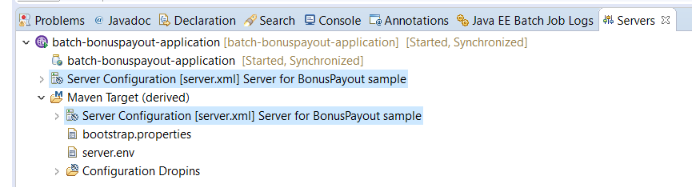

# Using Maven and WDT together

Finally we get to our ultimate goal, and the whole point of structuring the project and importing it following the steps described up until now (see [previous instructions][wdt]).

## Modifying the app

You could modify the app in any number of ways:
* You could cause the job to fail.   
* You could cause the job to complete with a different exit status, which would appear in the  
***Java EE Batch Job Logs*** view in Eclipse.   (Search the app for `setExitStatus` to see where it's being set from now).
* You could cause the job to log some additional information which would appear in the server logs (if using `System.out.println` or the job logs (if using **java.util.logging** logger methods). 

### Example sequence  
There's nothing special about the sequences detailed here.  The idea is just to show the flexibility.

#### Work with the app in both Maven & WDT
1. Start the server from WDT 
1. make app change, then save (watch app get updated)
1. Run job in WDT (detailed in [previous instructions][wdt]), and observe new effects)
1. Note WDT's application update **does NOT** re-execute the integration tests.
	* To do so, go to the command-line and do:  
	`$ mvn failsafe:integration-test`
	* **Note:** we're just running this goal from the failsafe plugin, **and NOT** the full `mvn integration-test`
1. Make another change, save.
1. Run the integration tests again (run them first this time). 
1. Run the job in WDT again
1. Etc.....  
  
#### Package via Maven

Say you have iterated through the above, and are happy with your updates and are ready to package and build a new application binary (and server package). 
 
1. Do a full Maven build:
`$ mvn clean install`

This will stop the server, wipe out and replace your WLP install with a clean installation, run the integration tests, and produce new binaries.
	
At this point, you could start fresh from "Work with the app in both Maven & WDT" above and iterate through the process again. 

## Changing server configuration

Of course, this is Liberty, so you can modify the server configuration at any point. Even if the server is started, the runtime will dynamically adjust to incorporate your changes.   

So you don't need to think of this as a separate "use case".  It could be done at any point in the "Work with the app..." sequences detailed above.

You could add/remove features, add more trace/logging, change connection pooling parameters, any number of things, then "Save" and the server and application will automatically update (similar to how the app will be updated with a change to an application part). 

### Where to find server config in WDT (server.xml)

One thing you should realize is that there are actually **two** copies of the server.xml that you can see in your WDT workspace.

You can see them both here:

  

The top one is the [src/main/liberty/config/server.xml](../src/main/liberty/config/server.xml) file that is versioned with your Git repostiory.

The bottom one is derived by the WDT Maven plugin, and is the config that the Liberty server actually runs against.
If you open it up you'll see it it lives within the **target** subdirectory of the repository root.

So a good practice is to simply:
 
1. Edit the **src** (top) version when making changes, Save, and, 
2. Allow the WDT Maven plugin to propagate/synchronize the changes to the **target** version, where they will be picked up by the runtime (restarting the app, and starting/stopping/restarting runtime components as necessary).

And of course, since the **src** server.xml is versioned along with the rest of the Git repo, you can leverage Git to manage change history, etc.  
  
## Further Reading

Each of these articles give a different overview/introduction to the Maven WDT integration, with different screenshots and highlights (from a broader rather than a batch-specific perspective). 

If you've worked through this sample up until now these will help reinforce what you learned and show another thing or two. 

* [WDT in Eclipse and Maven integration][wdt-mvn-1]
* [Building and running Liberty apps with Maven in Eclipse][wdt-mvn-2]

**Note**: the current sample has a couple differences, most importantly the need to do a Maven build **before** importing the project into WDT.   Also we do **Run As -> Java EE Batch Job** rather than ** Run On Server**.

## Links
* Jump to [main page](/README.md)
* Back to [Maven integration](/docs/Maven-integration.md)
* Back to [Using WDT]()

[wdt]: /docs/Using-WDT.md  "Using WDT"
[wdt-mvn-1]: https://developer.ibm.com/wasdev/blog/2017/06/28/wdt-in-eclipse-and-maven-integration "WDT in Eclipse and Maven integration"
[wdt-mvn-2]: https://developer.ibm.com/wasdev/docs/building-liberty-apps-maven-in-eclipse/ "Building and running Liberty apps with Maven in Eclipse"
