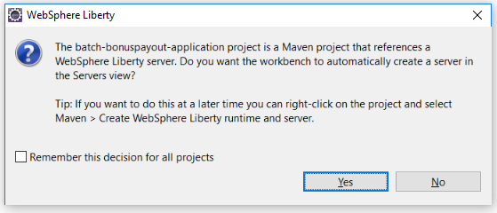
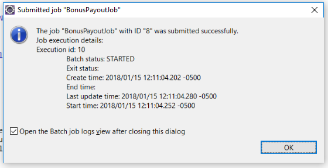

# Eclipse / WDT

The WebSphere Development Tools (WDT) for Eclipse can be used to control the server (start/stop/dump/etc.), it also supports incremental publishing with minimal restarts, working with a debugger to step through your applications, etc.

WDT also provides:

* content-assist for server configuration (a nice to have: server configuration is minimal, but the tools can help you find what you need and identify typos, etc.)
* automatic incremental publish of applications so that you can write and test your changes locally without having to go through a build/publish cycle or restart the server (which is not that big a deal given the server restarts in a few seconds, but still!)

# Installing

Installing WDT on Eclipse is as simple as a drag-and-drop, but the process is explained [on wasdev.net] [wasdev-wdt].

[wasdev-wdt]: https://developer.ibm.com/wasdev/downloads/liberty-profile-using-eclipse/

## To install the Java batch tools (an optional feature of WDT):

* In Eclipse, click *Help->Install WebSphere Software*.
* Click *Install* in the ***IBM Java EE Batch*** option then click *Finish*.

## Tested versions:

The latest versions of WDT and the ***Java EE Batch*** tools are  recommended.  This sample was tested at versions:
 * [Eclipse Oxygen 1a](https://www.eclipse.org/downloads/packages/eclipse-ide-java-ee-developers/oxygen1a)
 * WebSphere Developer Tools v17.0.0.2 or above
 * The level of **IBM Java EE Batch Tools for WebSphere Liberty** tested is:  
     * Version: 1.0.251.v20171004_2101

## Other necessary Eclipse plugins (m2e, etc.)

If this is the first time you've ever used Maven from within your Eclipse installation, you may need to install other plugins like m2e (Maven-to-Eclipse).  Probably most install methods would include these anyway as dependencies, but just noting since there are a lot of possible routes to install/update a given Eclipse installation with this full set of pluigns.

# Running project

## Clone Git Repo

If the sample git repository hasn't been cloned yet, WDT has git tools integrated into the IDE:

1.  Open the Git repositories view
    * *Window -> Show View -> Other*
    * Type "git" in the filter box, and select *Git Repositories*
2.  Copy Git repo url:
	* **https://github.com/WASdev/sample.batch.bonuspayout**
3.  In the *Git repositories* view, select the hyperlink `Clone a Git repository`
4.  The git repo url should already be filled in.  Select *Next -> Next -> Finish*
	* **Note:** the repository does not contain Eclipse project metadata, these are created by Maven import below. 
5.  The "sample.batch.bonuspayout [master]" repo should appear in the view

## (Important!) Run a Maven build  
Although in general, the idea here is that you can switch back and forth between `mvn` on the command-line and WDT, at this point in time the sample requires you to do a Maven build ***before*** you import the Maven projects. 
1. If you cloned the Git repository through Eclipse/WDT (and don't know the repository root directory used):
	* Expand the repository in the *Git repositories* view to see the "Working Directory" folder
	* Right-click on this folder, and select *Copy path to Clipboard*
2. From the repository root, run a `mvn install`  
```bash
$ mvn
```
This should complete successfully. 

## Import Maven projects into WDT
Now you can proceed:
1.  Select menu *File -> Import -> Maven -> Existing Maven Projects*
2.  In the Root Directory textbox, Paste in the repository directory and click *Finish*.
3.  This will pop-up a dialog from the WDT Maven integration.


7. Select *Yes* (and optionally check *Remember this decision for all projects*).

### Now wait for the WDT-Maven import processing to complete

The import will do a Maven build and will create:

* a Java project for the application
* a **batch-bonuspayout-application** (Liberty) Runtime environment 
 which contains a **BonusPayout** Liberty server
* this **BonusPayout** server will have application *batch-bonuspayout-application* published to it. 

## Run the BonusPayoutJob from WDT !

Finally, execute these steps:

1.  Start the **BonusPayout** server (you may need to open *Servers* view via *Window->Show View->Servers*).
	* Right-click the server and select *Start*.   
1.  Select the `batch-bonuspayout-application` project
2.  Find the Job definition (XML) in folder ***src/main/resources/META-INF/batch-jobs***.   
	* **Note:** if you use Package Explorer view in the *Java* perspective you'll have a quicker route to this path than using the Enterprise Explorer in the default *Java EE* perspective.) 
3.  Right-click on **BonusPayoutJob.xml ** and select *Run As->Java EE Batch Job*.
4.  Most of the wizard will be pre-populated, except for the userid and password.
5.  Supply the values:
```
 User ID:   bob
 Password:  bobpwd
```
6.  You should see a dialog like the following showing that the job was successfully submitted.
  
	* Typically the response will occur quickly enough relative to the job execution that you will see its Batch Status as **STARTED** (though it's possible it could end up **COMPLETED** by then).  
7. Leave the checkbox selected to go to the ***Java EE Batch Job Logs*** view afterwards, refreshing if necessary until the exit status shows as **YAYUH** (with default job parameters this will happen quickly).  The job has completed successfully !

## Next steps

Now that you have imported the project and run the job successfully, it's time to start experimenting, by modifying the application.

Continue on to [Using Maven and WDT together](/docs/Maven-WDT.md) for more details.

## Links
* Jump to [main page](/README.md)
* On to [Using Maven and WDT together](/docs/Maven-WDT.md)
* Back to [Maven integration](/docs/Maven-integration.md)

## Further Reading
* [WDT in Eclipse and Maven integration](https://developer.ibm.com/wasdev/blog/2017/06/28/wdt-in-eclipse-and-maven-integration)
* [Building and running Liberty apps with Maven in Eclipse](https://developer.ibm.com/wasdev/docs/building-liberty-apps-maven-in-eclipse/) 


