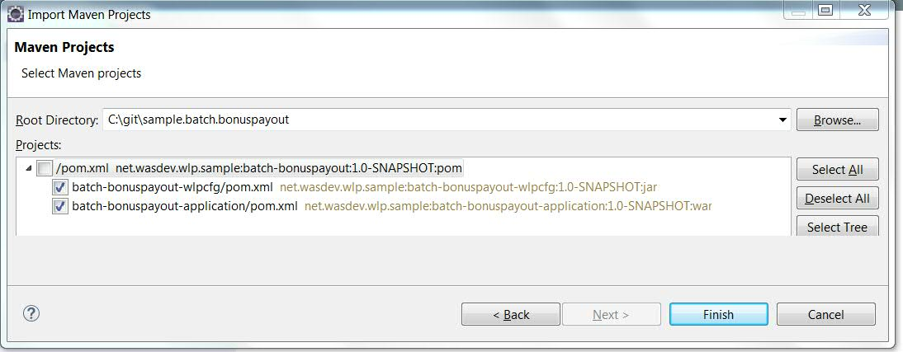
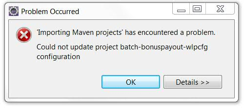
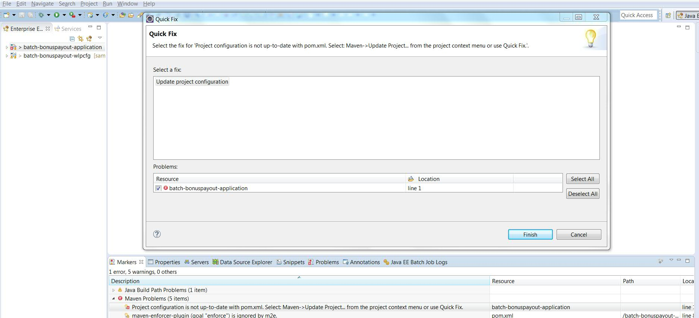

## Eclipse / WDT

The WebSphere Development Tools (WDT) for Eclipse can be used to control the server (start/stop/dump/etc.), it also supports incremental publishing with minimal restarts, working with a debugger to step through your applications, etc.

WDT also provides:

* content-assist for server configuration (a nice to have: server configuration is minimal, but the tools can help you find what you need and identify finger-checks, etc.)
* automatic incremental publish of applications so that you can write and test your changes locally without having to go through a build/publish cycle or restart the server (which is not that big a deal given the server restarts lickety-split, but less is more!).

Installing WDT on Eclipse is as simple as a drag-and-drop, but the process is explained [on wasdev.net] [wasdev-wdt].

[wasdev-wdt]: https://developer.ibm.com/wasdev/downloads/liberty-profile-using-eclipse/

### Clone Git Repo

If the sample git repository hasn't been cloned yet, WDT has git tools integrated into the IDE:

1.  Open the Git repositories view
    * *Window -> Show View -> Other*
    * Type "git" in the filter box, and select *Git Repositories*
2.  Copy Git repo url by finding the textbox under "HTTPS clone URL" at the top of this page, and select *Copy to clipboard*
3.  In the Git repositories view, select the hyperlink `Clone a Git repository`
4.  The git repo url should already be filled in.  Select *Next -> Next -> Finish*
5.  The "sample.batch.bonuspayout [master]" repo should appear in the view

### Import Gradle projects into WDT (!!! IGNORE:  NOT YET WORKING!!!!)

This assumes you have the Gradle IDE tools installed into Eclipse.

1. In the Git Repository view, expand the bonuspayout repo to see the "Working Directory" folder
2.  Right-click on this folder, and select *Copy path to Clipboard*
3.  Select menu *File -> Import -> Gradle -> Gradle Project*
4.  In the Root folder textbox, Paste in the repository directory.
5. Click *Build Model* 
6. Select all the projects (there should be three) and click *Finish*
7.  This will create 3 projects in Eclipse: batch-bonuspayout, batch-bonuspayout-application, and batch-bonuspayout-wlpcfg

:star: *Note:* If you did not use Eclipse/WDT to clone the git repository, follow from step 3, but navigate to the cloned repository directory rather than pasting its name in step 4.

### Import Maven projects into WDT

**Note:** If you did not use Eclipse/WDT to clone the git repository, begin at step 3, and supply the path of the cloned repository directory in step 4.

1.  In the Git Repository view, expand the bonuspayout repo to see the "Working Directory" folder
2.  Right-click on this folder, and select *Copy path to Clipboard*
3.  Select menu *File -> Import -> Maven -> Existing Maven Projects*
4.  In the Root Directory textbox, Paste in the repository directory.
5.  Select *Browse...* button.
6. **IMPORTANT:**  Un-select the parent project (*/pom.xml net.wasdev....*)

7. Select *Finish* now that only 2 checkboxes are selected.
8.  This will create 2 projects in Eclipse: batch-bonuspayout-application, and batch-bonuspayout-wlpcfg.    
**Note:** Ignore the "Problem Occurred" dialog. Simply click "OK" if you see this:

9. Fix the red X by the batch-bonuspayout-application  by going to the  ***Markers*** or ***Problems*** view, right-clicking and selecting *Quick Fix*

### Create a Runtime Environment and a Liberty Server

For the purposes of this sample, we will create the Liberty server (step 3 in the wasdev.net instructions) a little differently to create and customize a Runtime Environment that will allow the server to directly use the configuration in the `batch-bonuspayout-wlpcfg` project.

#### Create a Runtime Environment in Eclipse

1. Open the 'Runtime Explorer' view:
    * *Window -> Show View -> Other*
    * type `runtime` in the filter box to find the view (it's under the Server heading).
2. Right-click in the view, and select *New -> Runtime Environment*
3. Give the Runtime environment a name, e.g. `wlp-2015.6.0.0` if you're using the June 2015 beta.
4. Either:
    * Select an existing installation (perhaps what you downloaded earlier, if you followed those instructions), or
    * select *Install from an archive or a repository* to download a new Liberty archive.
5. Follow the prompts (and possibly choose additional features to install) until you *Finish* creating the Runtime Environment

#### Add the User directory from the maven or Gradle project, and create a server

1. Right-click on the Runtime Environment created above in the 'Runtime Explorer' view, and select *Edit*
2. Click the `Advanced Options...` link
3. If the `batch-bonuspayout-wlpcfg` directory is not listed as a User Directory, we need to add it:
    1. Click New
    2. Select the `batch-bonuspayout-wlpcfg` project
    3. Select *Finish*, *OK*, *Finish*
4. Right-click on the `batch-bonuspayout-wlpcfg` user directory listed under the target Runtime Environment in the Runtime Explorer view, and select *New Server*.
5. The resulting dialog should be pre-populated with the `BonusPayout` Liberty profile server.
   The default name for this server can vary, you might also opt to rename it from the Right-click menu in the Servers view to make it easier to identify.
6. Click *Finish*

#### Running Liberty and the sample application from WDT

1.  Select the `batch-bonuspayout-application` project
2.  Right-click -> ***TODO*** 
3.  Select the appropriate server (as created above) and select *Finish*

:star: *Note:* Some versions of WDT incorrectly map the cdi-1.2 dependency to the CDI 1.0 Facet, which prevents the *Run As ...* operation in step 2 from succeeding. If this happens, Right-click on the `async-jaxrs-application` project, and select *Properties*, then select *Project Facets* in the left-hand pane. Change the the "Context and dependency injection (CDI)" facet to use version 1.2, at which point, step 2 (above) should work. 

## Tips

* When importing the existing maven project into Eclipse, Eclipse will (by default) "helpfully" add this project to an (extraneous) ear. To turn this off, go to Preferences -> Java EE -> Project, and uncheck "Add project to an EAR" before you import the project. If you forgot to do this, just delete the ear project; no harm.

